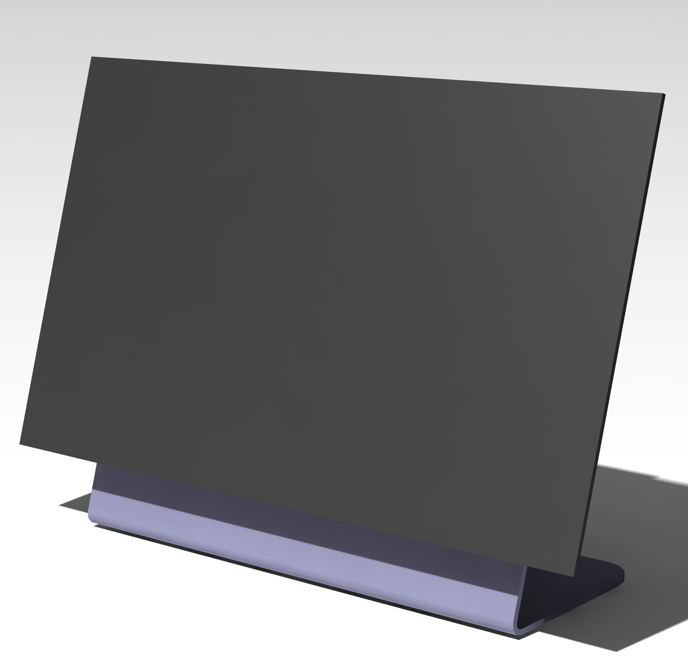
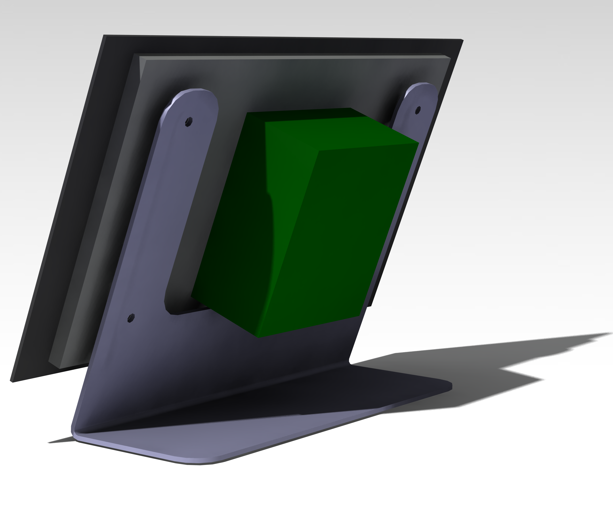
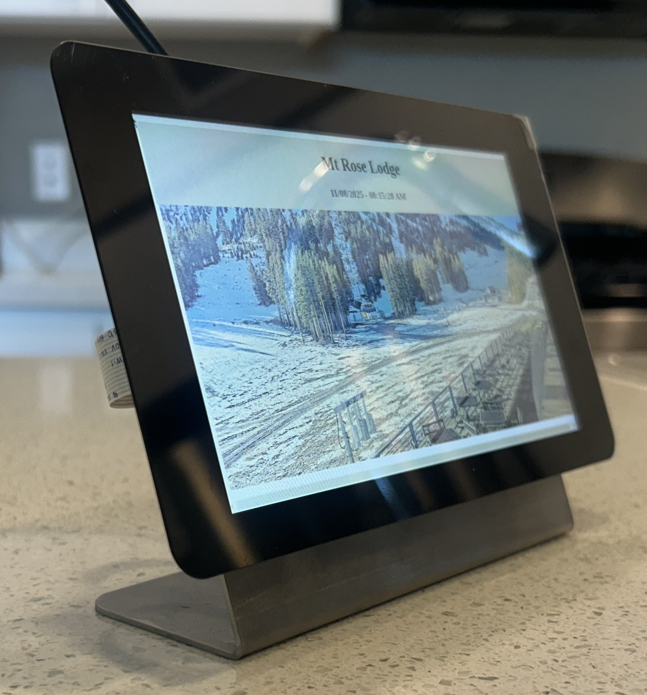
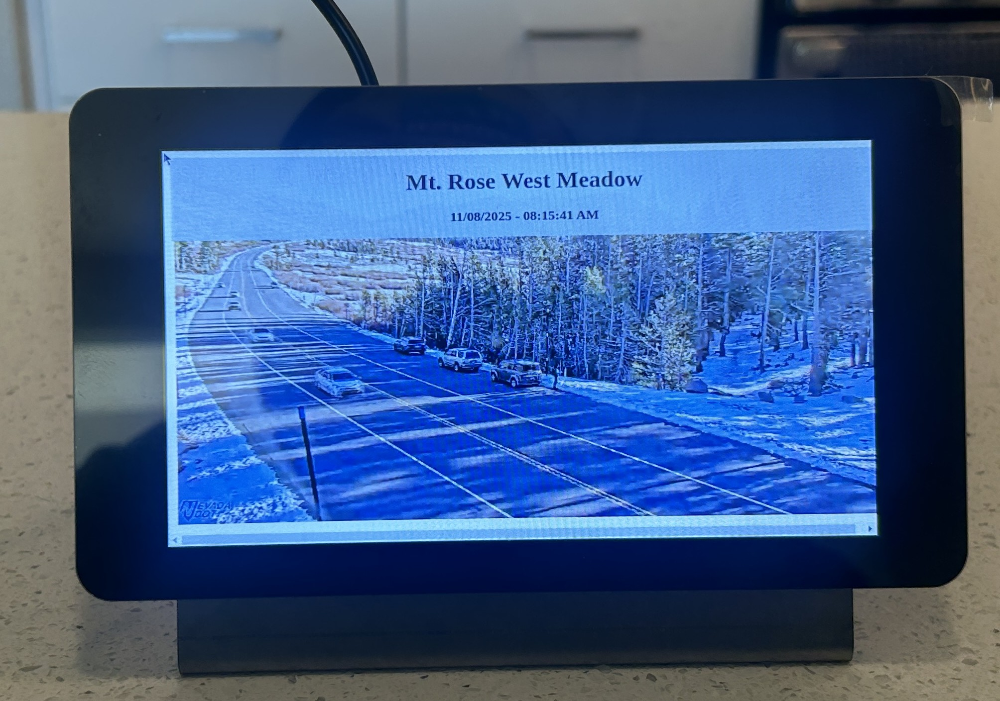
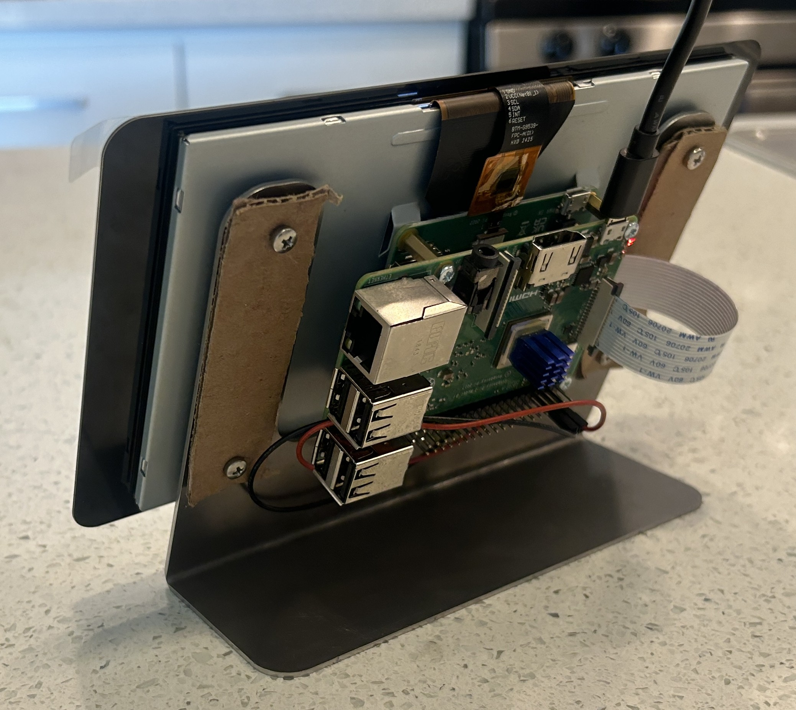

# What is this?
This is a webcam cycler that flips through webcams of places that I like. 

The conceptual idea comes from a live photo frame that I was recently gifted by my family. The live photo frame flips through photos added by family members, like a slideshow.

This project flips through various live web cameras in places that I like.

## How is auto-boot setup?
Basic instructions from: https://www.youtube.com/watch?v=-L1TetCc-oc
                        https://fuzzthepiguy.tech/browser-gui/

added a startup line to /etc/xdg/lxsession/LXDE-pi/autostart

```
@lxterminal -e /home/logan/Desktop/WebCamViewer/rpiStart.sh &
```

## Rotate Display
Because of the wiring direction on the pi, I want the screen to be 'upside down'. To flip the display output: 
```
sudo nano /boot/config.txt
```
comment out this line: 
```
# dtoverlay=vc4-kms-vd3
```
add this line, to the bottom of the config.txt file, to flip display 180 degrees: 
```
lcd_rotate=2
```

# Hardware
Computer: Raspberry Pi 3B+ Bullseye
Display: Raspberry Pi 7" touchscreen
Display mount: Custom bent 16Ga cold-rolled 1008 carbon steel sheet

## Pictures of final build
  

  

The mounting method uses 4x M3x0.5x8mm phillips button head bolts, as shown, they are too long for this applicaton, but that is what I had on hand. Instead of buying new bolts, or washers, I decided to make a 'washer' from some cardboard. It doesnt look great, but performs the needed function and is on the 'B' side; no harm, no foul.




# TODO List: 
    - Add touchscreen buttons to go forward and backwards in recent videos, incase you want to watch the previous video again..?